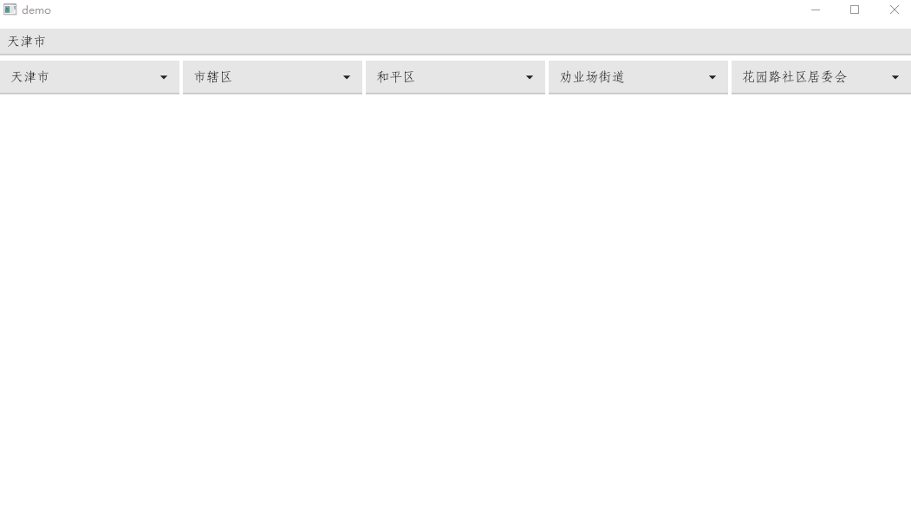

# fynex

#### 介绍
about fyne

#### 软件架构
软件架构说明

#### 安装教程

1. git clone https://gitee.com/y2h/fynex.git
2. cd fynex/example
3. go run .

#### 使用说明

  
<b>image/custom_fyne_slider 可显示取值范围和当前值的滑块控件</b>

  

  
<b>left-right-border 左宽（窄）右窄（宽）布局</b>

  

  
<b>selectpage 可分页的下拉选择控件</b>

  

  
<b>supertext，可设置颜色、大小，响应点击、hover事件的超级标签控件</b>

  

  
<b>日历控件</b>

  

  
<b>点击选择文件的图片控件</b>

  

  
<b>行政区划选择控件</b>

  

  
<b>mandelbrot</b>

  

  
<b>zip and unzip</b>

  

  
<b>starlight</b>

  

  
<b>clock窗口最小化时程序会崩溃</b>

  

  
<b>gopsutil</b>

  

1.  xxxx
1.  xxxx
2.  xxxx
3.  xxxx

#### 参与贡献

1.  Fork 本仓库
2.  新建 Feat_xxx 分支
3.  提交代码
4.  新建 Pull Request

#### 特技

1.  使用 Readme\_XXX.md 来支持不同的语言，例如 Readme\_en.md, Readme\_zh.md
2.  Gitee 官方博客 [blog.gitee.com](https://blog.gitee.com)
3.  你可以 [https://gitee.com/explore](https://gitee.com/explore) 这个地址来了解 Gitee 上的优秀开源项目
4.  [GVP](https://gitee.com/gvp) 全称是 Gitee 最有价值开源项目，是综合评定出的优秀开源项目
5.  Gitee 官方提供的使用手册 [https://gitee.com/help](https://gitee.com/help)
6.  Gitee 封面人物是一档用来展示 Gitee 会员风采的栏目 [https://gitee.com/gitee-stars/](https://gitee.com/gitee-stars/)
